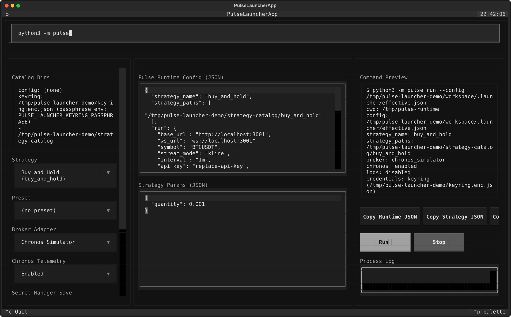

# Pulse Launcher

Pulse Launcher is a Textual-based Terminal UI (TUI) designed to prepare, manage,
and run Pulse runtime configurations directly from strategy manifests.

It removes the friction of managing complex JSON configurations and raw
credentials by hand while keeping execution local.

## Core Features

- **Strategy Discovery:** Discovers and parses local strategy catalogs.
- **Config Merging:** Merges predefined presets into an effective Pulse config.
- **Secure Credentials:** Resolves API keys and secrets from an encrypted local keyring.
- **Subprocess Management:** Previews the execution command and starts/stops Pulse
  as a managed subprocess.

For config-file setup, manifest schema, keyring behavior, and supported
environment variables, see [docs/quickstart.md](docs/quickstart.md).
